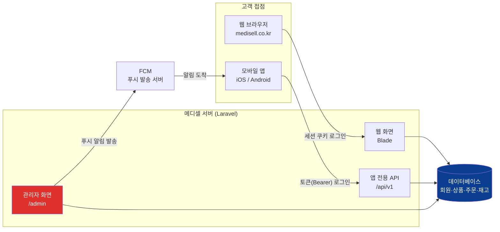
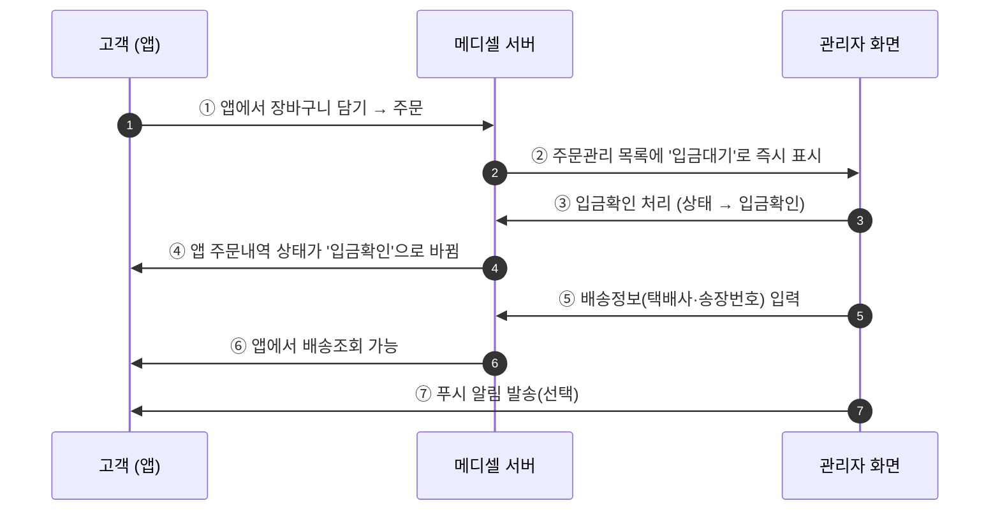

# 모바일 앱 · 웹 연계 흐름 (PPT 부록 슬라이드용)

> 핵심 메시지: **앱과 웹은 서로 다른 시스템이 아니다.** 같은 서버·같은 데이터베이스를 쓰고,
> 접속 방식(세션 쿠키 vs 토큰)만 다르다. 그래서 앱에서 들어온 주문도 관리자 화면에 바로 보인다.

---

## 슬라이드 A. 전체 구조 한 장

**발표 스크립트**
> 메디셀은 웹사이트와 모바일 앱이 하나의 서버를 공유합니다. 고객이 웹에서 주문하든 앱에서 주문하든
> 같은 데이터베이스에 저장되므로, 관리자님은 **주문관리 화면 한 곳만 보시면 됩니다.**
> 앱 따로, 웹 따로 확인할 필요가 없습니다.

---

## 슬라이드 B. 로그인 방식의 차이 (알아만 두시면 되는 내용)

| 구분 | 웹 | 앱 |
|---|---|---|
| 로그인 후 유지 방식 | 브라우저 세션 쿠키 | 발급된 접속 토큰 |
| 자동 로그아웃 | 브라우저 종료·2시간 후 | 앱에서 로그아웃할 때까지 유지 |
| 같은 계정 사용 | ✅ 동일 계정으로 양쪽 로그인 가능 | ✅ |

**발표 스크립트**
> 회원은 같은 아이디로 웹과 앱을 모두 쓸 수 있습니다. 웹은 브라우저를 닫으면 로그인이 풀리지만,
> 앱은 로그아웃하지 않으면 계속 로그인 상태가 유지됩니다. 고객이 "앱에서는 로그인돼 있는데
> 웹에서는 풀렸다"고 문의하면 이 차이 때문입니다.

---

## 슬라이드 C. 업무별 연결 흐름 — 관리자 화면과 앱이 어떻게 맞물리는가

**발표 스크립트**
> 앱에서 주문이 들어오면 관리자 주문관리에 곧바로 나타납니다. 관리자님이 입금확인을 누르면
> 고객 앱의 주문 상태도 같이 바뀝니다. 별도로 앱에 입력하는 작업은 없습니다.
> 송장번호를 넣으면 앱에서 배송조회가 되고, 필요하면 푸시 알림으로 안내할 수 있습니다.

---

## 슬라이드 D. 앱에서 쓸 수 있는 기능 = 관리자 화면에서 관리하는 대상

| 앱 화면 | 대응하는 관리자 메뉴 | 관리자가 하는 일 |
|---|---|---|
| 홈 · 카테고리 · 상품상세 | 상품 / 카테고리 / 브랜드 | 상품·가격·이미지 등록 |
| 홈 배너, 추천 영역 | 배너 / 사이드 광고 | 노출 배너 교체 |
| 장바구니 → 주문/결제 | 주문관리 / 입금확인 | 입금확인·배송처리 |
| 마이페이지 적립금·쿠폰 | 회원관리 / 쿠폰 | 적립금 조정, 쿠폰 발행 |
| 병원 전용가 표시 | 회원관리 / 거래처 단가 | 사업자 승인, 전용가 등록 |
| 구매 대행자 메뉴 | 대행 캐쉬백 | 캐쉬백 정산 |
| 1:1 문의 · 실시간 상담 | 문의관리 / 실시간 상담 | 답변 |
| 상품 후기 | 후기관리 | 노출/숨김 |
| 푸시 알림 수신 | 푸시 알림 | 발송 |

**발표 스크립트**
> 앱에 보이는 거의 모든 내용은 관리자 화면에서 관리됩니다. 왼쪽이 고객이 보는 앱 화면,
> 오른쪽이 관리자님이 작업하는 메뉴입니다. 예를 들어 앱 홈의 배너를 바꾸고 싶으면
> '전시관리 → 배너'에서 이미지를 교체하면 앱에도 함께 반영됩니다.

---

## 슬라이드 E. 자주 나오는 질문

| 질문 | 답변 |
|---|---|
| 앱 주문은 따로 확인해야 하나요? | 아닙니다. 주문관리 한 곳에 웹·앱 주문이 함께 표시됩니다. |
| 상품을 등록하면 앱에도 바로 보이나요? | 네. '판매중'으로 저장하면 앱에도 즉시 반영됩니다. |
| 앱에만 보이는 가격을 따로 넣나요? | 아닙니다. 가격은 한 번만 등록하고 웹·앱이 같이 씁니다. |
| 푸시 알림은 앱 설치자에게만 가나요? | 네. 앱을 설치하고 알림을 허용한 회원에게 발송됩니다. |
| 앱을 업데이트해야 새 상품이 보이나요? | 아닙니다. 상품·가격·배너는 서버에서 내려주므로 앱 업데이트가 필요 없습니다. |
